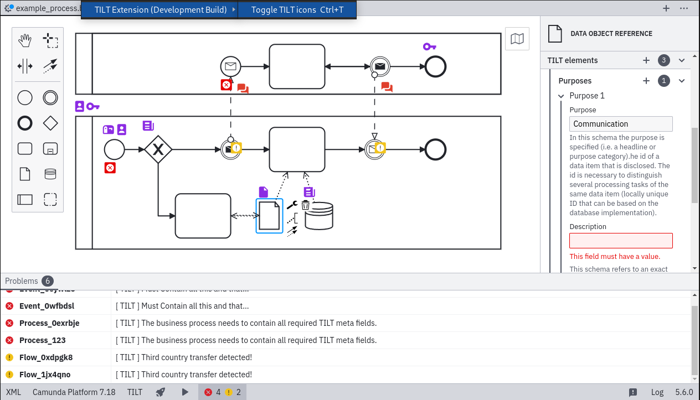
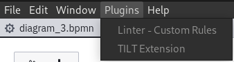

# TILT Camunda Modeler Plug-in
## Features
This plug-in for the Camunda Modeler provides a TILT elements properties panel extension that allows users to append TILT transparency information to process elements:



The information will automatically append to the xml representation of the model in the following format:

```xml
<bpmn:extensionElements>
      <tilt:meta name="Blue Company" created="2020-04-03T15:53:05.9295" modified="2020-04-03T15:53:05.9295" version="2" language="en" status="active" url="Mythisturl.com" />
    </bpmn:extensionElements>
```
## Installation

### Requirements
- **Camunda Platform 7**:
This TILT extension for the Camunda BPMN modeler currently supports Camunda Platform **7.18** bpmn diagrams only.
- **Camunda Modeler v5.6.0**: This plugin requires a recent Camunda Modeler of version **5.6.0**. Versions for Windows, Mac and Linux are available at: https://camunda.com/download/modeler/

### Installation steps

1. Download the latest **tilt-release.zip** file from the releases page: https://github.com/ciphersmaug/tilt-camunda-plugin/releases/

2. Copy or link the extracted folder into your Camunda Modeler plug-in directory
    
    2.1. The plug-in folder can be usually found in the camunda modeler installation directory in the subdirectory resources. For example under ``./camunda-modeler-5.4.2-linux-x64/resources/plugins``
    
    2.2 After you placed the tilt-release folder into the plugin directory a simple 
    ```
    tree ./camunda-modeler-5.4.2-linux-x64/resources/plugins/tilt-release
    ``` 
    should return something like the following:
    ```
    .
    ├── client
    │   ├── descriptors
    │   │   └── tilt.json
    │   ├── index.js
    │   ├── linting
    │   │   └── index.js
    │   ├── tilt-extractor
    │   │   └── menu.js
    │   └── tilt-properties
    │       ├── extensions-helper.js
    │       ├── fields
    │       │   └── meta.js
    │       ├── index.js
    │       ├── props
    │       │   └── tilt-property-groups.js
    │       ├── tilt-extension-provider.js
    │       └── tilt-io-helper.js
    ├── dist
    │   ├── client.js
    │   └── client.js.map
    ├── index.js
    └── README.md

    ```

3. Simply start the Camunda Modeler. The plug-in should now be automatically loaded. Verify that the plugin is loaded correctly by looking at the menu bar on top: 

    

    Should the menu item contain an **\<Error\>** then make sure to use the most recent release of this plug-in.


## Building

### Requirements
- Node.js 14

### Building steps
1. Install dependencies
    ```sh
    npm install
    ```

2. Package plugin to `dist/client.js`:
    ```sh
    npm run bundle
    ```

3. Place the build into the Camunda Modeler plug-in directory
    MacOs:
    ```
    '/Applications/Camunda Modeler.app/Contents/MacOS/resources/plugins/'
    '/Users/${username}/Library/Application Support/camunda-modeler/resources/plugins'
    ```

4. Execute the Camunda Modeler

## Creation of a Release
1. Create a `main` - branch commit and tag it in the following schema: `v*.*.*`.

    ```
    git tag v0.0.1
    ```
2. Push the branch to origin using the following command: 
    ```
    git push origin v0.0.1
    ```

## Licence

**MIT** see: [LICENSE.md](LICENSE.md)
